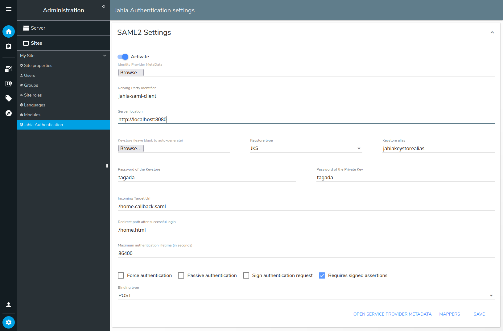
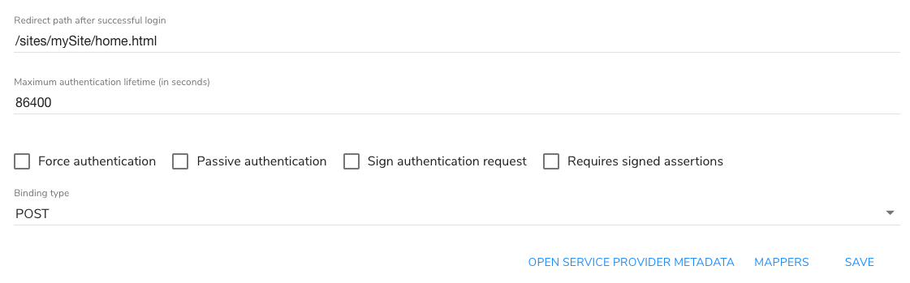
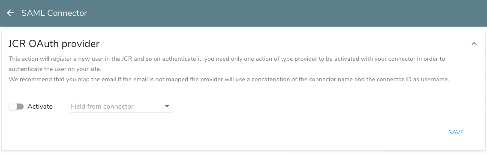
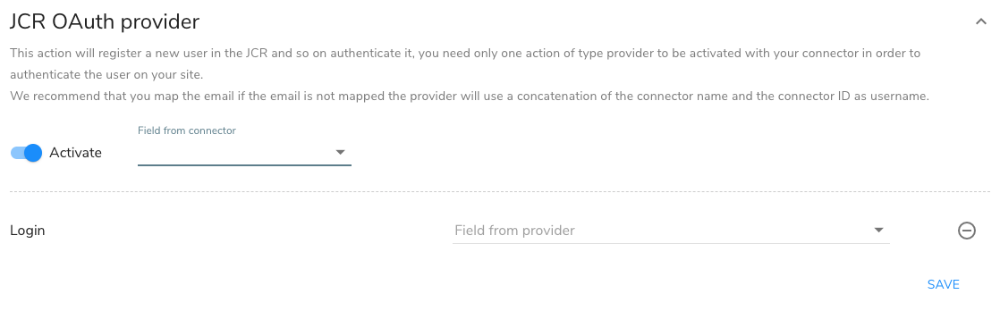
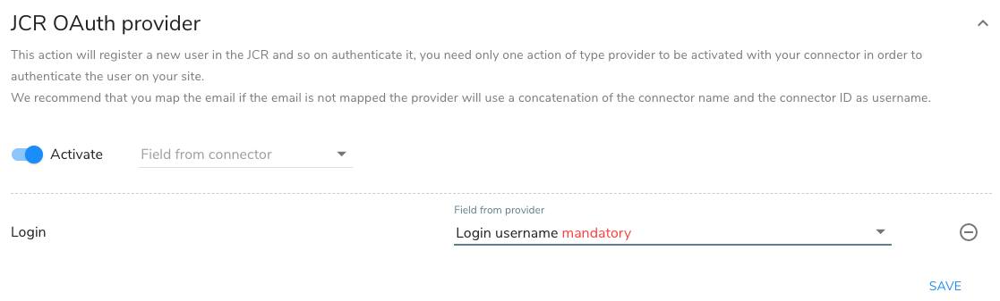

---
page:
  $path: /sites/academy/home/documentation/jahia/8_2/developer/authentication/installing-and-configuring-SAML2
  jcr:title: Installing and configuring SAML2 authentication
  j:templateName: documentation
content:
  $subpath: document-area/content
publish: false
---

The [SAML2 Authentication Valve module](https://store.jahia.com/contents/modules-repository/org/jahia/modules/saml-authentication-valve.html) enables you to activate SAML on one or more of your Jahia websites.

## Installing the SAML2 Authentication Valve module

To make SAML available in Jahia, deploy the module and install it on your site. You must also deploy and install the [Jahia Authentication](https://store.jahia.com/contents/modules-repository/org/jahia/modules/jahia-authentication.html) and [JCR Authentication Provider](https://store.jahia.com/contents/modules-repository/org/jahia/modules/jcr-auth-provider.html) modules. 
For more information on deploying modules, see [Installing a module](https://academy.jahia.com/cms/render/default/training-kb/tutorials/administrators/installing-a-module) tutorial.

## Creating a keystore

You can manually create the keystore that will communicate with the Identity Provider (IdP). The following command shows example values used to create a keystore.

```bash
keytool -genkeypair -alias jahiakeystorealias -keypass changeit -keystore sp.jks -storepass changeit -keyalg RSA -keysize 2048 -validity 3650
```

When you run the command, you will be prompted with the following question. Your answer must match your Jahia site domain name (jahia.server.name).

- What is your first and last name?: **jahia.server.name** (This value must match your Jahia site domain name)

## Configuring SAML2 authentication

SAML configuration is stored in a file in the `karaf/etc` folder. There is one configuration file per site. You can configure SAML in **Site Settings** in Jahia.

To configure SAML:

1. In Jahia, navigate to **Administration>Sites>Jahia Authentication** and expand **SAML2 Settings**.

    
2. Toggle the **Activate** slider to enable.
3. In **Identity Provider MetaData** file, click **Choose File** and upload the Identity Provider Metadata XML file provided by the Identity Provider (IdP), for example, Shibboleth or Google.
4. In **Relying Party Identifier**, provide the identifier of your Service Provider that is sent to the IdP.
5. In **Server Location**, provide the public URL of your Jahia site, for example, `http://localhost:8080`. It will be used to generate the Service Provider metadata.
6. In **Keystore, Keystore type, Keystore Alias, Password of the Keystore,** and **Password of the Private Key** enter values that you defined when creating the server key and certificate. You can also leave the keystore empty and fill in the other values to automatically generate a new keystore. Note that the generated keystore will use the hostname for the CN entry of the certificate.
7. In **Incoming Target Url**, enter the URL where the IdP will return the SAML response. The default value is `/home.callback.saml`.
8. In **Redirect after successful login**, enter the Jahia relative URL where users are redirected after successful authentication, for example, `/home.html`.
9. In **Maximum authentication lifetime**, enter the maximum age of the authentication on the IdP. Users must reauthenticate if the session on the IdP is older than the specified time.
10. Select from the following options:
    - **Force authentication**  
       If set, users must authenticate every time they login, even if the user has already a session on the IdP. This cannot be used along with `Passive authentication`.

    - **Passive authentication**
       If set, users log in transparently without any interaction. Users are authenticated only if the IdP is able to do so without asking the user. This cannot be used along with `Force authentication`.

    - **Sign authentication request**
       Sign the request sent to the IdP.

    - **Requires signed assertions**
       If set, will only accept signed assertions from the IdP.

11. In **Binding type**, select the SAML binding type used to communicate with the IdP.
12. Click **Save**.

After saving your SAML configuration, the **Open Service Provider Metadata** and **Mappers** buttons become available at the bottom of the page. You can use **Open Service Provider Metadata** to download service provider metadata based on the configuration. This can be required to configure the IdP.

#### Configuration example

```
# SAML Configuration file - autogenerated
siteKey = digitall
enabled = true
identityProviderMetadata = ...
relyingPartyIdentifier = test-local
serverLocation = http://localhost:8080
keyStore = ...
keyStoreAlias = saml2clientconfiguration
keyStorePass = changeit
privateKeyPass = changeit
incomingTargetUrl = /home.callback.saml
postLoginPath = /home.html
maximumAuthenticationLifetime = 86400
forceAuth = false
passive = false
requireSignedAssertions = false
signAuthnRequest = true
bindingType = urn:oasis:names:tc:SAML:2.0:bindings:HTTP-POST
keyStoreType = PKCS12
mapperName = jcrOAuthProvider
```

### Mapping users

Next, map the fields that are used to authenticate users in your IdP to the fields used to authenticate users in Jahia. You specify how to map user data to a user in Jahia.  You first select the IdP field that is used as the username. Then you map it to the appropriate username field in Jahia. You can also choose a specific mapper that creates a new user in the JCR.

To map users:

1. On the **SAML2 Settings** page, click **Mappers**.

   
   The SAML Connector page opens.

2. Expand the provider type that is available for you to configure. The following example shows how to configure settings for the JCR Authentication Provider module.
   
   

3. Toggle the **Activate** slider to enable.

4. In **Field from connector**, select the fields to map from your IdP. For example, select **Login**.

   

5. In **Field from provider**, select the fields to map to in Jahia. For example, select **Login username mandatory**.

   

6. Click **Save**.

Next, add a login button or form to a page in your site to redirect Jahia users to the SAML IdP.

### Adding a login form

Users are redirected from Jahia to the SAML IdP when they call the `*.connect.saml?siteKey={sitekey}` url. To redirect users, you can add a simple link in the page (for example, http://localhost/sites/mySite/home.connect.saml?siteKey=mySite) or add an HTML form.

Jahia also provides a simple form component, SAML2 Login, with the module. The component displays a simple login button which calls the action. When a user clicks the login button, they are redirected to the IdP with the SAML login request from Jahia. Once logged in, the IdP redirects to Jahia with a signed assertion containing the user information.

### Using `redirect` query param

If you want the user to come back to a specific page after login, you can add a `redirect` query param to the URL. For example, to redirect the user to the `/about-us.html` page after login, use the following URL: 

```
/sites/mySite/home.connect.saml?siteKey=mySite&redirect=/sites/mySite/about-us.html
```

You can also customize the SAML2 Login component to add a `redirect` query param to the URL.

```jsp
<c:if test="${not renderContext.loggedIn}">
    <form action="${renderContext.mainResource.node.name}.connect.saml" method="GET">
        <input type="hidden" name="siteKey" value="${renderContext.site.siteKey}"/>
        <input type="hidden" name="redirect" value="${renderContext.mainResource.nodePath}.${renderContext.mainResource.templateType}"/>
        <input type="submit" value="${currentNode.displayableName}">
    </form>
</c:if>
```

:::info
Redirect URL cannot link to sites or pages outside the current Jahia site for security reasons. Only local URLs are accepted without any hostname or domain name. URL content is also filtered to avoid any XSS attack.
:::

### Considerations about `siteKey` query param

As the SAML configuration is per site, **you must include** a `siteKey` query param in the connection URL, for example, `?siteKey=mySite` and also in the SAML configuration **Incoming Target Url**. 
If you don't do so, the SAML authentication will not work and you will get an error in the log file.

You can omit that if the server name is mapped to a site in Jahia and the server name is always used in URLs. Thus, the site can be retrieved from the server name and the query param is not needed.
Without the query param, the SAML authentication **won't work** using http://localhost access.

:::info
Even when having a server name configured, using the query param is always safer and faster as it will always work and does not need any lookup in the Jahia Sites list.
:::

## SAML authentication process and private pages or sites

On some occasions, you might want to protect some pages or an entire site using SAML authentication by enforcing user permissions on pages and maybe the site itself. In this case, you must ensure that the SAML authentication is triggered correctly.

The default Jahia configuration will always return a 404 HTTP error (Not Found) when a user tries to access a private page or site without being authenticated. This is done for security reasons, to avoid exposing the existence of private pages or sites. 
For some reason, you may want to change that behavior and redirect users to the SAML IdP especially when a complete site is private to start the user's login process when accessing the site.

### Configure Jahia to allow 401 HTTP errors (Unauthorized)  

The configuration is located in `jahia.properties` and cannot be changed from the Jahia UI. You must edit the file directly on the server. It is also a server configuration that applies to all sites hosted on the server.

```
# Define behaviour when the user has no access to a resource (page or file)
# silent : returns a 404 when the resource does not exist or is not accessible
# authorizationError : returns a 401 for guest users and 403 for authenticated users without access permission
protectedResourceAccessStrategy=authorizationError
```

Thus, when a user tries to access a private page or site without being authenticated, they will get a 401 HTTP error (Unauthorized). 
The default 401 Jahia page includes a login form that will not work with SAML authentication but the embedded Jahia authentication.

To ensure that the 401 error page contains a link or form to redirect users to the SAML IdP, you must **customize the 401 error page**.

Follow the documentation page about [Custom error pages](https://academy.jahia.com/training-kb/knowledge-base/how-to-customize-the-error-pages) 

In the case where the site itself is not public (aka guest cannot read it), the custom error page won't be able to load from the template set, and you have to put it directly in the Jahia file system: 

```bash
cp error_401.jsp <tomcat_home>/webapps/ROOT/errors/sites/<mySite>/error_401.jsp
```

Such a sample jsp page could be: 

```html
<%@page language="java" contentType="text/html; charset=UTF-8" session="false" %>
<!DOCTYPE html>
<html lang="en">
<head>
    <title>SAML Login</title>
</head>
<body>
<div style="margin: 50px; font-family: Arial, sans-serif;">
    The resource you try to access is protected, and you don't have the required permissions.
    <br/>
    Please log in with an account that has the required permissions.
    <br/><br/>
    <a href="${pageContext.request.requestURI}.connect.saml?siteKey=mySite">Go to SAML login page</a>
</div>
</body>
</html>
```

:::info
You can always route the user to the SAML Authentication from an external link (a portal page, for example) using the site url followed by connect.saml?siteKey={sitekey} as explained in the Adding a login form section.
:::

### Understanding SAML Authentication errors

Clients will only (and always) receive HTTP 400 errors with a simple message indicating that the authentication failed according to the current step (connect or callback).
When such an error occurs, you have to check the log file to understand the reason for the failure.

Common reasons for SAML authentication failures are:
- Missing or wrong `siteKey` query param in the URL.
- Missing or unreadable SAML configuration for the site.
- Wrong keystore or certificate configuration.
- Mismatched Relying Party Identifier.

### Related links

More details on configuration options can be found in the pac4j library documentation: [http://www.pac4j.org/3.2.x/docs/clients/saml.html](http://www.pac4j.org/3.2.x/docs/clients/saml.html)
